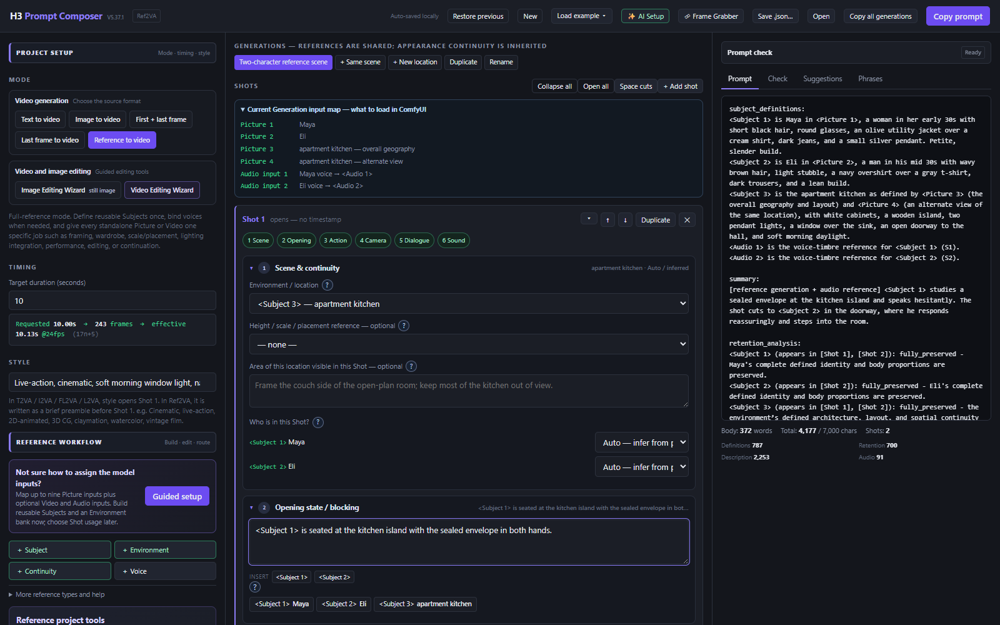
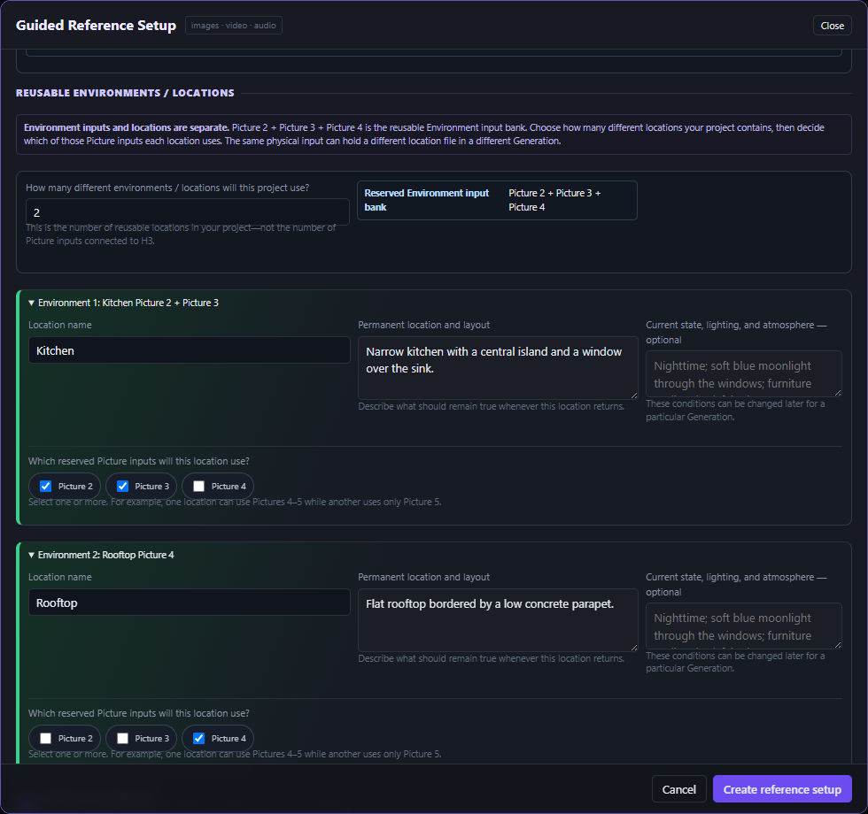
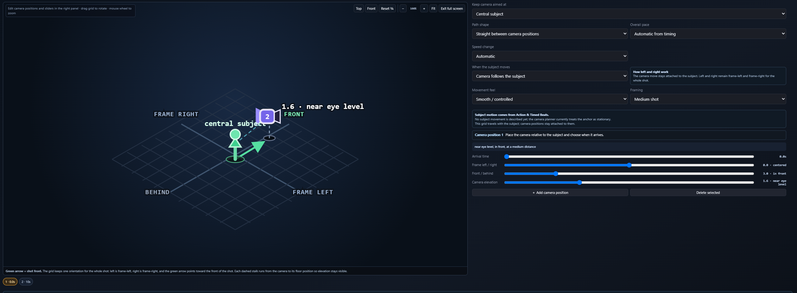
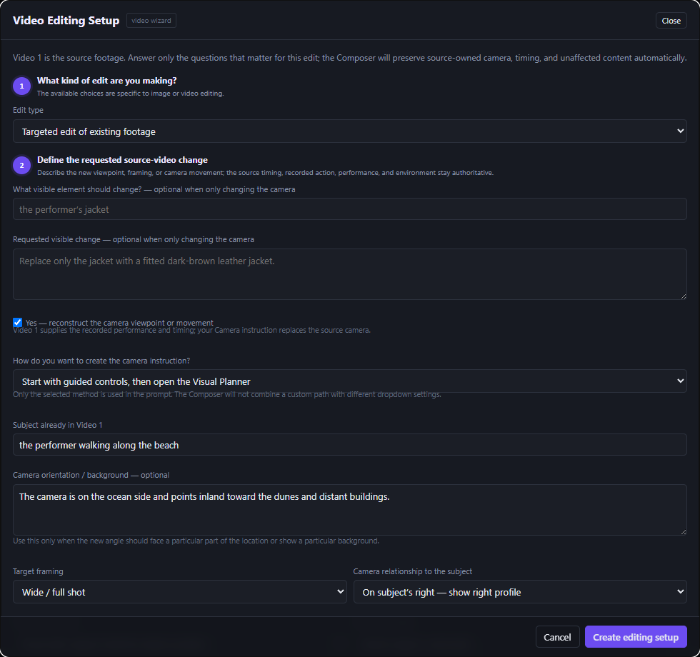
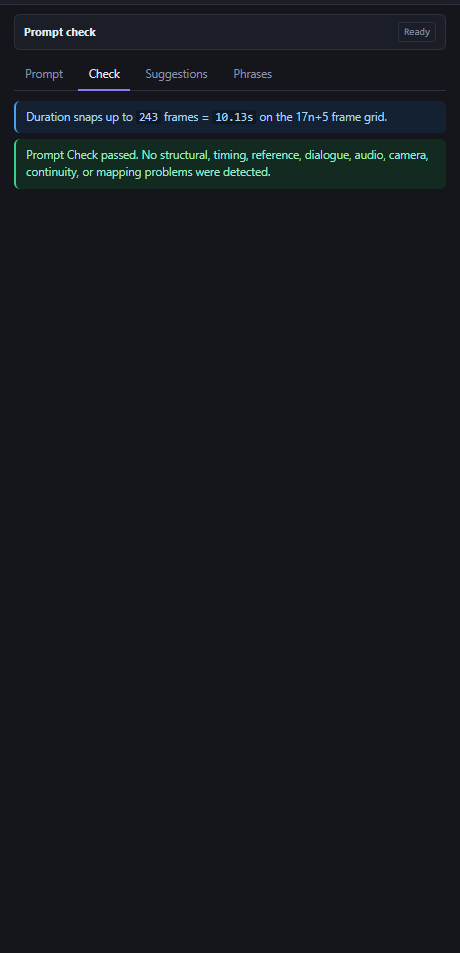
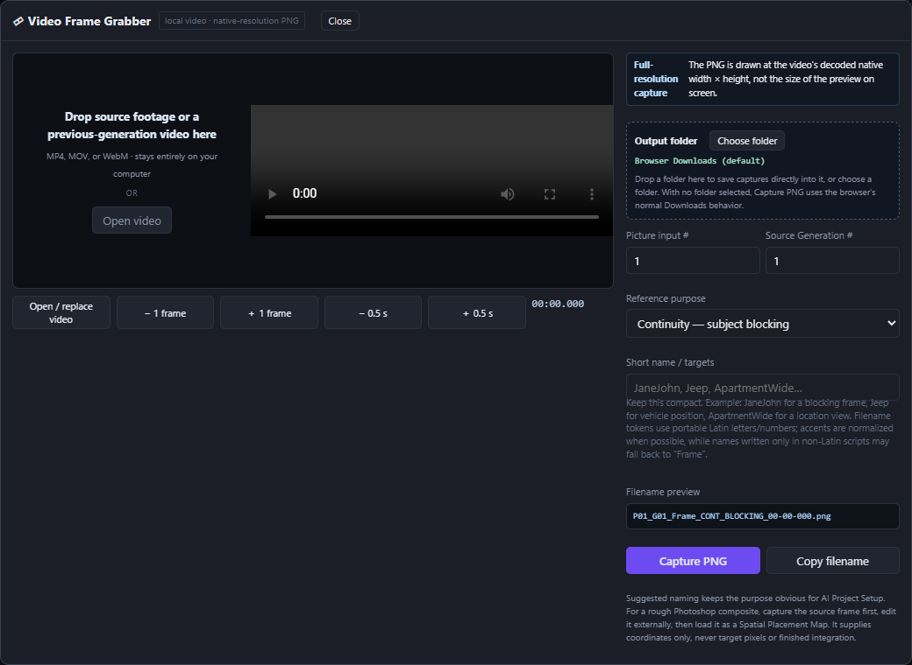
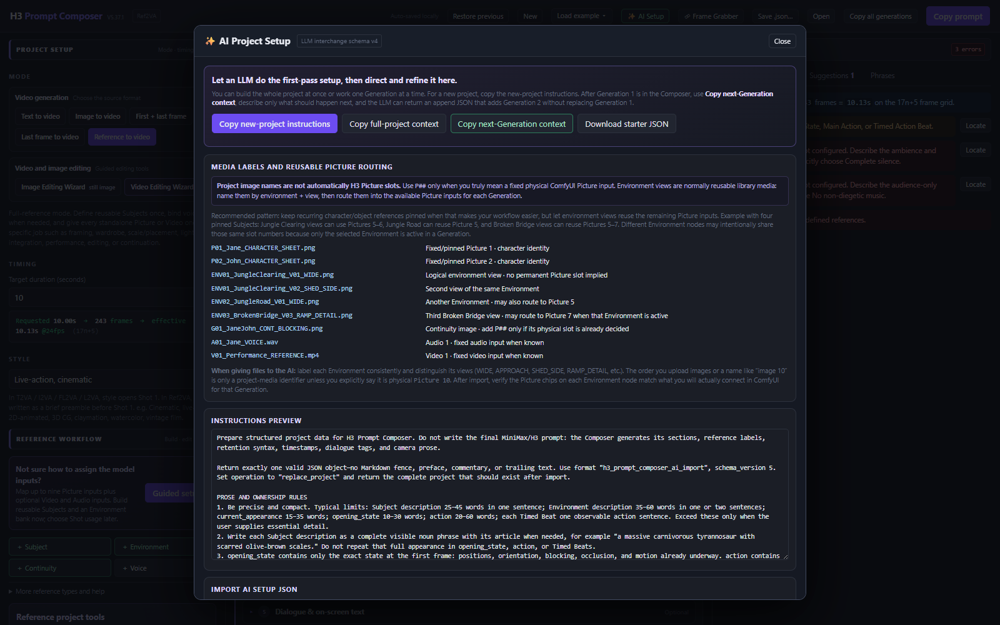
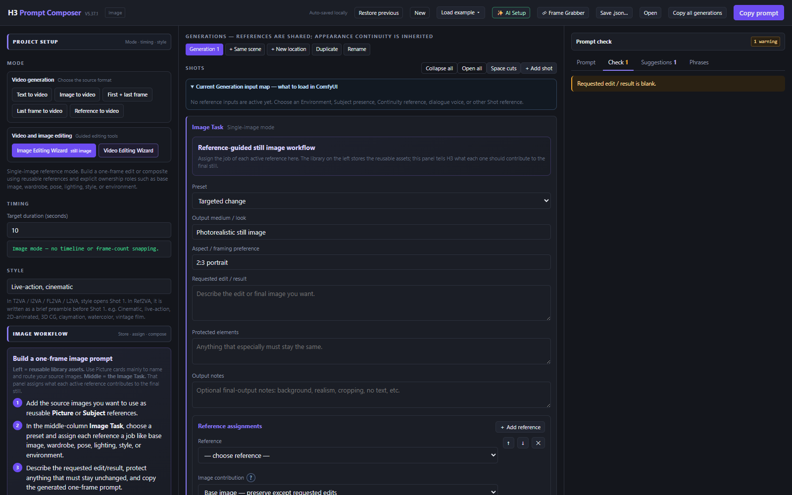

# H3 Prompt Composer

**版本 5.37.14**

**🌐 语言：** [English](README.md) · [中文 (简体)](README-zh.md)

一款免费、独立运行的提示词构建应用，用于 **MiniMax H3** 视频生成和参考引导的图像工作流，界面右上角有菜单能够把语言从English切换到中文。

**单个 HTML 文件 · 无需安装 · 在浏览器中本地运行**

## 视频教程

**[在 YouTube 上观看 V5.37.1 教程](https://youtu.be/Aywx3Sf5Yk0)**

## 它能做什么

H3 Prompt Composer 将你的电影制作选择转化为结构化的 H3 提示词。你可以通过可视化控件管理引用、镜头、时长、摄影机运动、对白、连续性、剪辑和声音；应用会在生成前组装出正确的提示词结构并加以检查。

- 为 **T2VA、I2VA、FL2VA、L2VA、Ref2VA 和参考引导图像** 构建提示词。
- 组织可复用的角色、环境、图片、视频、声音、连续性帧和位置指南。
- 通过引导式设置映射 ComfyUI 物理输入，无需手动管理标签。
- 从可复用的图片输入库中创建多个命名环境位置。
- 提供摄影机构建器和可视化摄影机路径规划器。
- 包含插入、替换、定向编辑、重新布光、表演迁移和续接等引导式工作流。
- 处理定时镜头、动作节拍、对白、画外音、场景转场、截断、环境声和音乐。
- 检查提示词结构、时长、引用、音频、摄影机、连续性和输入路由。
- 离线运行，除非你选择保存或导出，否则项目数据保留在浏览器中。

## 功能与界面

### 引导式引用与摄影机规划

| 引导式引用设置 | 可视化摄影机规划器 |
| --- | --- |
|  |  |
| 映射相连的图片、视频和音频输入。创建命名位置，并为每个位置分配共享环境库中的子集。 | 放置定时摄影机位置，选择直线或弧线运动，并生成一条自然的摄影机指令。 |

### 编辑与提示词检查

| 引导式定向编辑 | 提示词检查 |
| --- | --- |
|  |  |
| 定义请求的修改，保护源素材，并选择一种摄影机编写方式。 | 在生成前发现结构、时长、引用、对白、音频、摄影机、连续性和映射冲突。 |

### 项目工具

| 本地帧抓取器 | AI 项目设置 |
| --- | --- |
|  |  |
| 从本地视频捕获原始分辨率 PNG 帧，并赋予用途可读的文件名。 | 为外部 LLM 导出结构化项目上下文，并在导入前校验返回的项目 JSON。 |

### 参考引导图像模式

构建单帧编辑或合成提示词，包含明确的参考角色、请求的修改、受保护元素和输出要求。

## 快速开始

1. 下载 **[H3_Prompt_Composer_V5_37_14.html](H3_Prompt_Composer_V5_37_14.html)**。
2. 在 Chrome、Edge、Firefox 或其他现代浏览器中打开它。
3. 选择一种模式，描述生成内容，只添加你需要的引用。
4. 查看 **检查**，然后点击 **复制提示词**，将结果粘贴到你的 H3 工作流中。

Composer 描述已连接到 H3 或 ComfyUI 的媒体。它不会上传引用文件，也不会自己运行模型。

## 支持的工作流

| 模式 | 用途 |
| --- | --- |
| **T2VA** | 文生视频 |
| **I2VA** | 从必需的首帧图像开始 |
| **FL2VA** | 连接必需的首帧和末帧 |
| **L2VA** | 朝向必需的最终图像生成 |
| **Ref2VA** | 全参考生成、编辑、续接和音频工作流 |
| **Image** | 参考引导的静态图像编辑或合成 |

## 当前版本

V5.37.14 延续了 V5.37.1 的工作流和文档，更新了摄影机提示词和引导式引用设置的行为。

完整版本说明请参阅 **[V5.37.1 更新日志](H3_Prompt_Composer_V5_37_1_CHANGELOG.md)**。

## 手册与下载

- **[完整用户指南](H3_Prompt_Composer_V5_37_1_User_Guide.pdf)** — 完整工作流与字段参考。
- **[图文用户指南](H3_Prompt_Composer_V5_37_1_Illustrated_User_Guide.pdf)** — 可视化快速入门与功能导览。
- **[SHA-256 校验和](H3_Prompt_Composer_V5_37_14_SHA256.txt)** — 用于验证独立 HTML 文件。

## 本地与隐私设计

该应用完全自包含，没有外部脚本、样式表、账户或服务器依赖。正常使用过程中不会发出任何网络请求。浏览器功能仅用于本地存储、剪贴板复制、用户选择的项目/媒体文件、保存、导出和本地帧捕获。

## 免责声明

H3 Prompt Composer 是一款独立的社区工具，不是 MiniMax 或 ComfyUI 的官方产品。提示词检查通过并不能保证模型完全遵循指令；结果仍取决于模型、工作流设置和引用质量。
