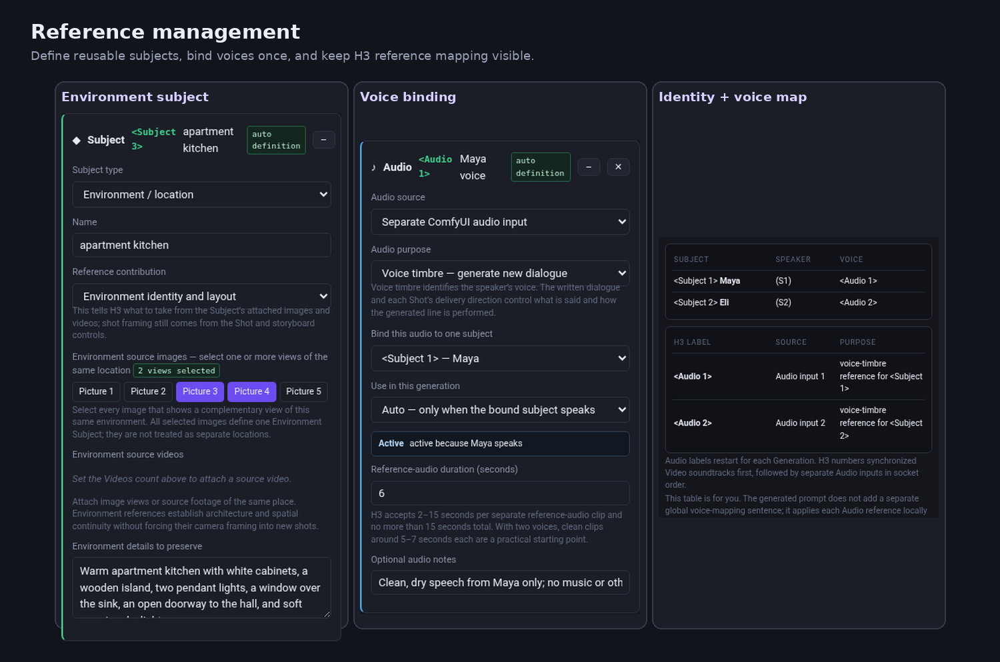
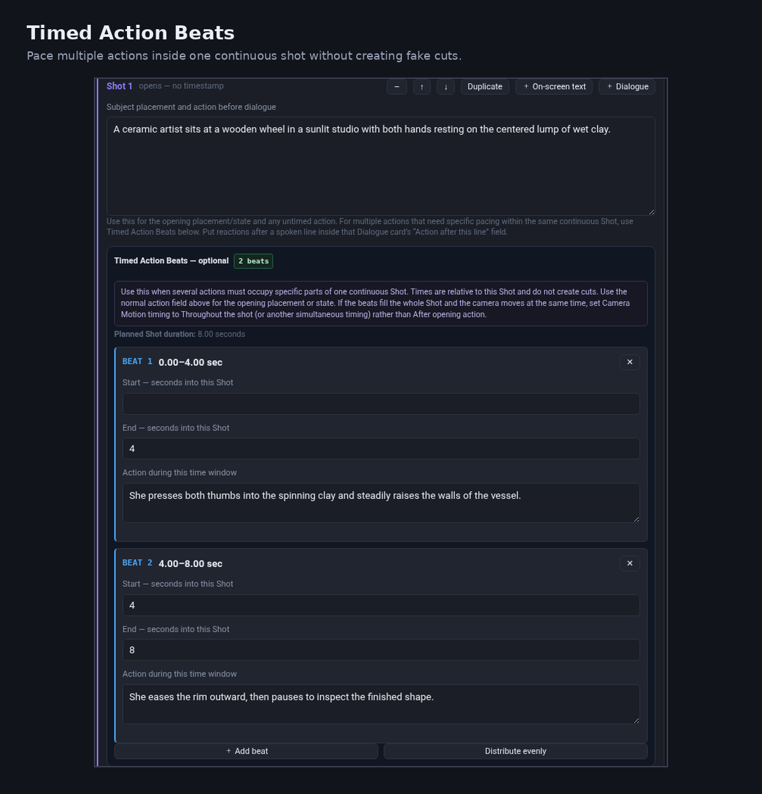
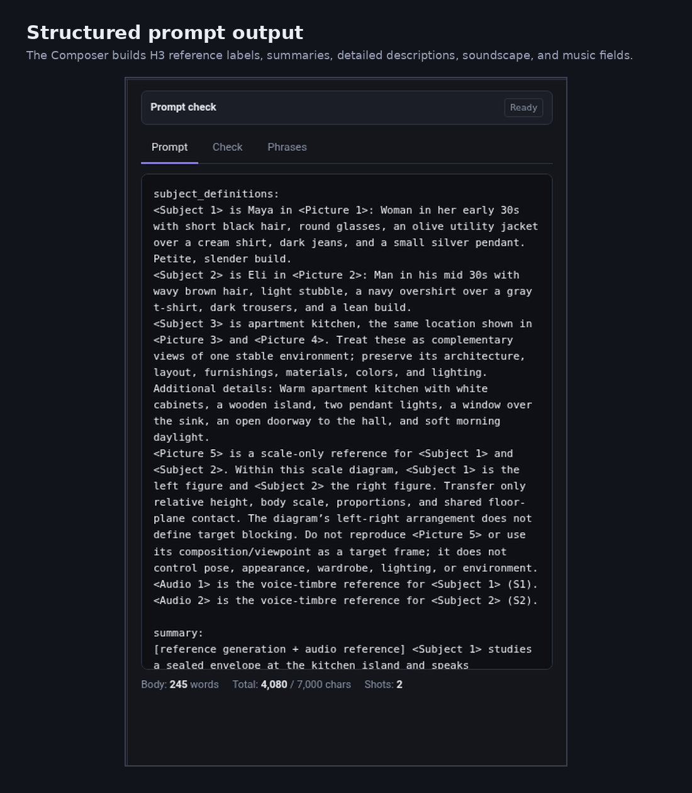

# H3 Prompt Composer

**Version 5.11.1**

A free, standalone prompt-building tool for **MiniMax H3 video generation**, designed primarily for **ComfyUI** workflows.

H3 Prompt Composer turns plain-language creative choices into structured H3 prompts. Instead of manually tracking reference syntax, subject numbering, voice mapping, shot structure, timing, and camera terminology, you build the scene through a browser interface and the Composer assembles the prompt for you.

**Standalone HTML • No installation • Runs locally in your browser**

---

## Quick Start

1. Download `H3_Prompt_Composer_V5_11_1.html`.
2. Open it in a modern browser such as Chrome, Edge, or Firefox.
3. Choose the H3 mode you are using.
4. Set the target duration and visual style.
5. For Ref2VA, define the Subjects and references connected to your ComfyUI workflow.
6. Build the Generation using one or more Shots.
7. Add camera behavior, actions, dialogue, timing, sound, and music as needed.
8. Read **Prompt Check** and resolve anything important.
9. Click **Copy Prompt** and paste the result into the matching H3 conditioning node in ComfyUI.

If you're new to the Composer, start with **Load example → Full reference scene** or open the included Illustrated User Guide.

---

## Supported H3 Modes

- **T2VA** — text-only generation
- **I2VA** — Picture 1 is the starting frame
- **FL2VA** — Picture 1 is the first frame and Picture 2 is the last frame
- **L2VA** — Picture 1 is the required final frame
- **Ref2VA** — characters, environments, voices, videos, editing, and other multi-reference workflows

The Composer changes its generated prompt structure automatically for the selected mode.

---

## Reference Management

Ref2VA projects can contain reusable characters, creatures, vehicles, props, environments, pictures, videos, and audio references.

The Composer is designed around a simple principle: **give each reference one clear job**.

- Character/source images belong inside their reusable Subject.
- Multiple views of one location can define a single Environment Subject.
- Voice samples can be bound to a Subject once and resolved automatically when that Subject speaks.
- Standalone Pictures are reserved for jobs such as frame anchors, storyboard references, wardrobe transfer, environment state, or character scale.
- The Identity and Voice Map shows how active H3 labels will be sent for the current Generation.

---

## Generations, Shots, and Timed Action Beats

The Composer separates the timeline into three levels:

### Generation
One complete H3 generation request/output. A project can contain multiple Generations so you can build a sequence while carrying useful continuity forward.

### Shot
One continuous camera setup inside a Generation. Create another Shot when there is an actual cut, transition, or new camera view.

### Timed Action Beat
A timed action window inside one continuous Shot. Use these when actions need specific pacing without creating a cut.

For example, a continuous 8-second Shot can spend the first four seconds on one action and the next four seconds on another while remaining a single camera setup.

---

## Endpoint-First Camera Builder

The Camera Builder works from endpoints rather than vague movement commands:

1. Define the **Start Frame**.
2. Define the **End Frame**.
3. Choose a **Camera Motion** that physically connects them.

Controls include framing, Subjects, viewpoint, camera height, composition, movement, timing, speed, stabilization, lens behavior, depth of field, focus, and custom camera instructions.

The Composer can also flag incompatible or contradictory combinations instead of silently building them into the prompt.

---

## Dialogue, Voices, and Audio

Dialogue cards support:

- Speaker assignment
- Exact spoken words
- Language
- Delivery/performance direction
- Automatic voice-reference resolution
- Off-screen or voice-over behavior
- Actions that happen immediately after a spoken line

Overall soundscape and non-diegetic music are managed separately so persistent scene ambience can carry forward while Generation-specific sounds remain local to that clip.

---

## Guided Video Reference Workflows

The Composer includes guided starting points for several common Ref2VA tasks:

### Insert Subject Into Existing Footage
Preserve a source plate and camera while integrating a generated Subject with grounding, occlusion, shadow, focus, and motion behavior.

### Background Replacement + Relighting
Keep a filmed performer while replacing the existing background and transferring the new environment's lighting and visual integration onto the Subject.

### Performance + Camera Transfer
Use a source video as a performance and/or camera-motion reference while applying that performance to the target Subject.

Built-in examples are included for these workflows.

---

## Prompt Check

Prompt Check acts as a guardrail before generation. It can surface blocking errors, warnings, and informational guidance for issues such as stale references, invalid assignments, timing conflicts, reference limits, prompt length, voice mapping, and contradictory camera instructions.

A warning does not necessarily mean the prompt is unusable; it means the Composer found something worth reviewing.

---

## Structured Prompt Output

The Composer builds the H3 structure for you, including the appropriate reference labels and mode-specific sections.

You do not need to manually renumber `<Subject>`, `<Picture>`, `<Video>`, or active `<Audio>` labels for normal Composer workflows.

---

## Continuity Between Generations

A project can contain multiple Generations.

**New Generation** carries forward useful continuity such as the base soundscape, music choice, and supported Subject appearance state while resetting Generation-specific extra sounds.

**Duplicate Generation** creates a variation from the same Shots and settings.

Supported character Subjects can also use reusable Appearance States for changes such as wardrobe, wet clothing, injury state, or other persistent visual continuity.

---

## Saving Projects

The Composer automatically saves the active project locally in the browser.

You can also save a project as a JSON file and reopen it later. Use **Save Project** when you want a portable backup, since browser storage can be lost if site data is cleared or you switch browsers.

---

## Privacy and Security

H3 Prompt Composer V5.11.1 is designed to run locally.

This build:

- Does **not** require an account
- Does **not** require installation
- Does **not** require an internet connection
- Does **not** load remote JavaScript libraries or stylesheets
- Does **not** send prompts or project information to an external server
- Does **not** contain `fetch`, XMLHttpRequest, WebSocket, or other network-request code
- Does **not** use `eval()` or dynamically execute downloaded code

The complete application source is contained in the HTML file and can be inspected directly in this repository.

The application uses normal browser features for local functionality:

- `localStorage` for autosave / restore
- Clipboard access when you press **Copy Prompt**
- `FileReader` when you explicitly open a saved project JSON file
- Browser-generated local downloads when you save a project

The Composer does **not** load your ComfyUI images, videos, or audio files. It describes how reference inputs already connected in ComfyUI should be interpreted by H3.

---

## Documentation

### Illustrated User Guide

`H3_Prompt_Composer_V5_11_1_Illustrated_User_Guide.pdf`

A visual walkthrough with screenshots covering the core workflow, references, timeline model, Camera Builder, dialogue, Prompt Check, saving, and troubleshooting.

### Full User Guide

`H3_Prompt_Composer_V5_11_1_User_Guide.pdf`

A more detailed reference for the complete Composer workflow and controls.

---

## What the Composer Does Not Do

H3 Prompt Composer is a **prompt authoring and organization tool**. It does not:

- Run MiniMax H3 itself
- Connect directly to ComfyUI
- Upload or process your source media
- Replace ComfyUI reference inputs
- Guarantee that H3 will follow every instruction exactly

The goal is to make H3 prompts clearer, more structured, and easier to manage. Final behavior still depends on the underlying model, references, generation settings, and normal experimentation.

---

## Feedback

If you find a bug or an H3 prompting case the Composer does not handle well, feel free to open a GitHub Issue. Helpful reports include:

- What you were trying to create
- Which H3 mode you were using
- The relevant reference setup
- The generated prompt, when possible
- What you expected
- What happened instead

---

## Version

**H3 Prompt Composer V5.11.1**

H3 Prompt Composer is an independent community tool and is not an official MiniMax or ComfyUI product.
