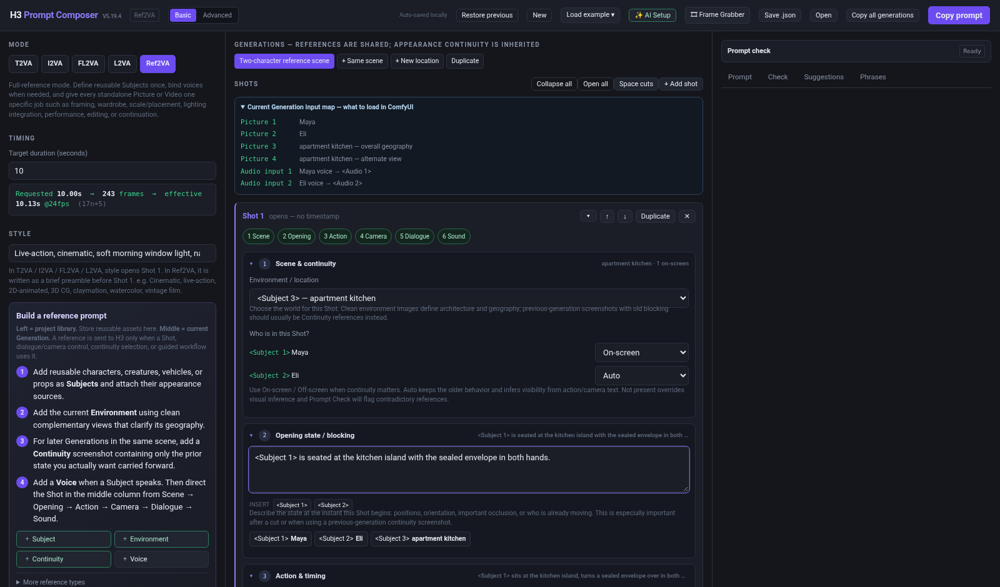
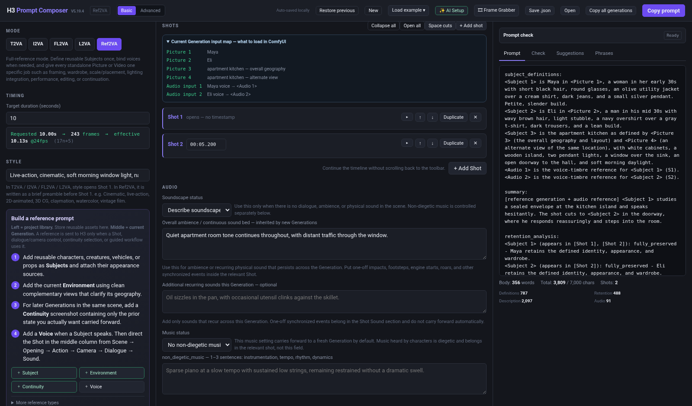
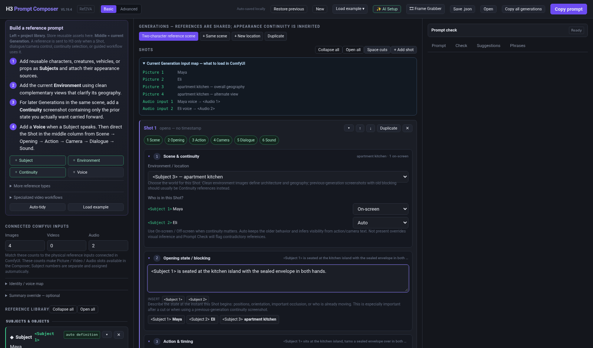
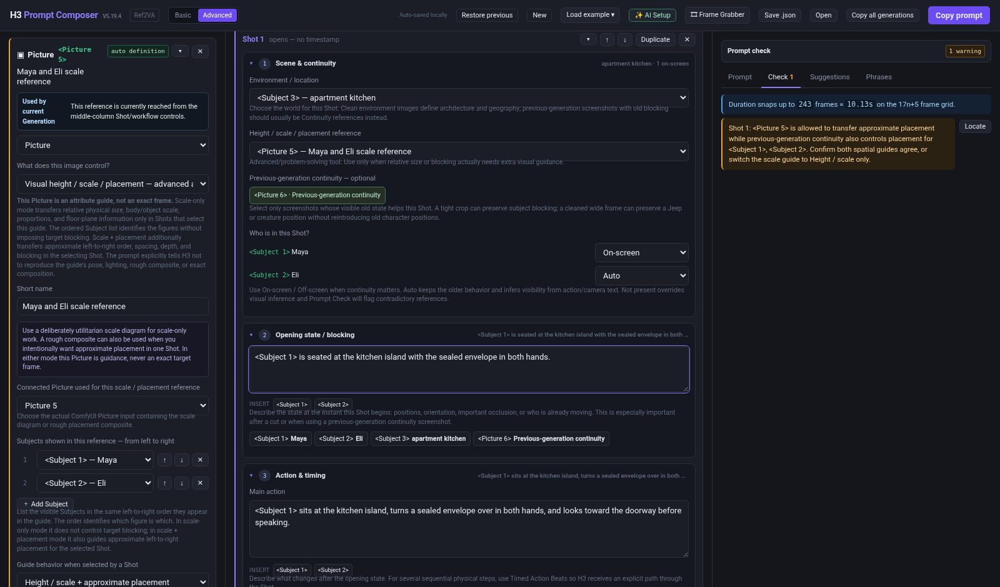
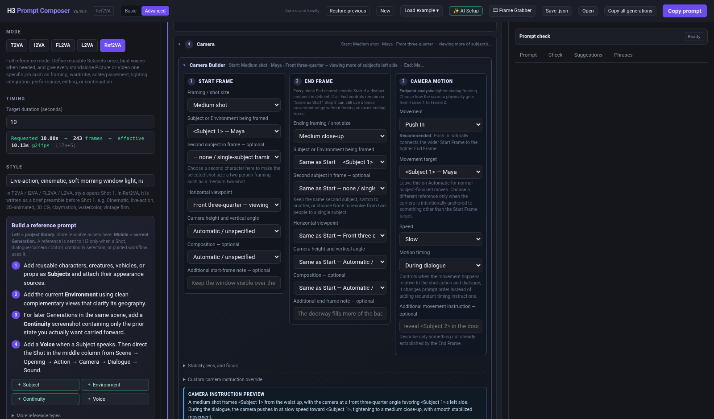
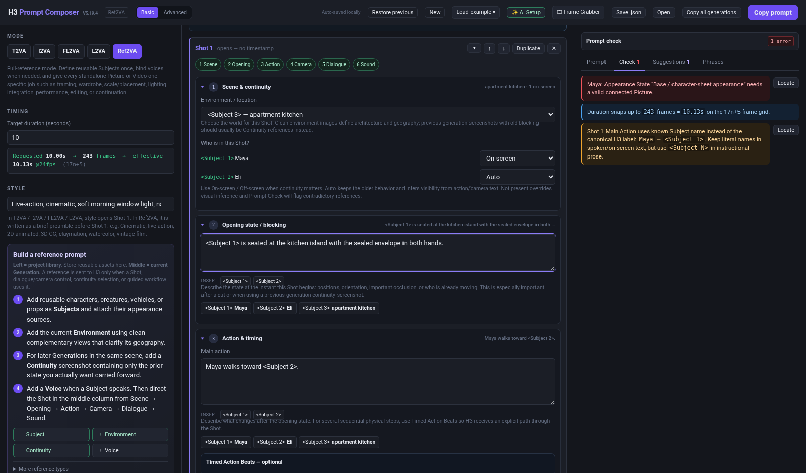
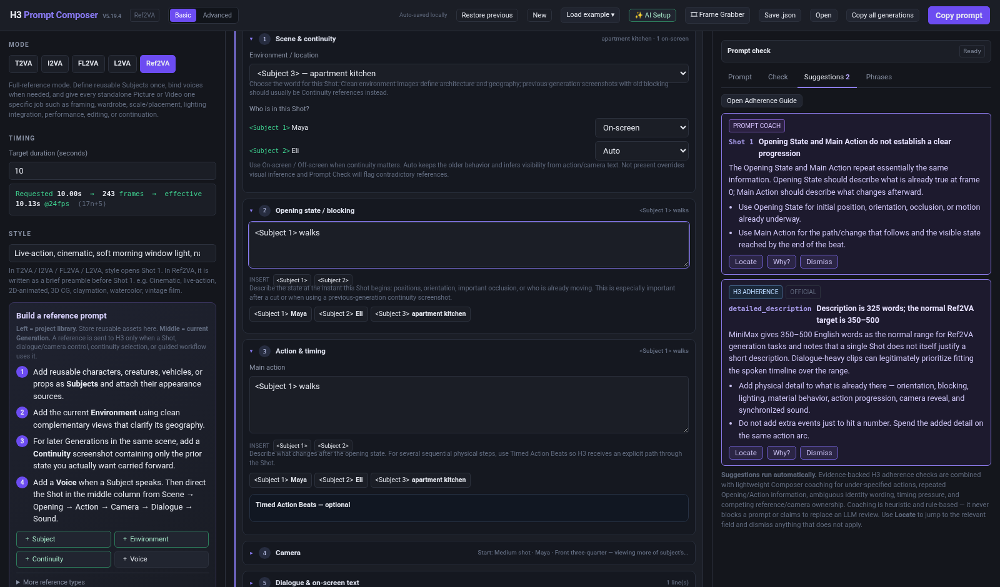
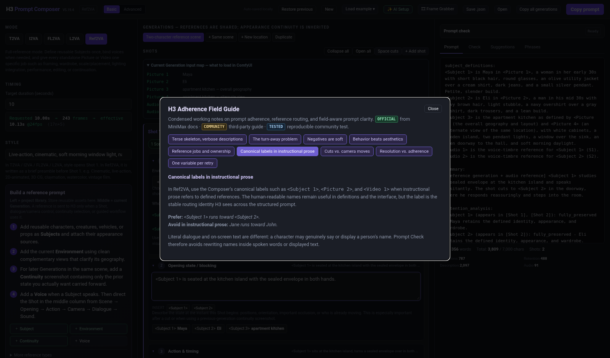
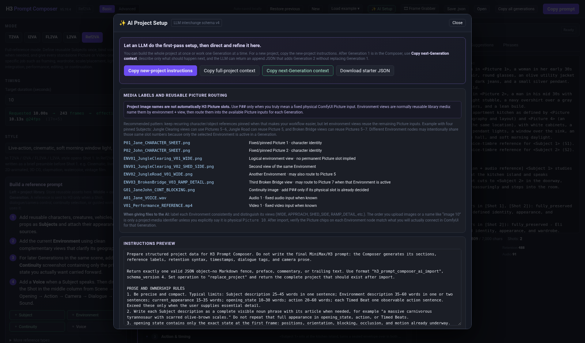
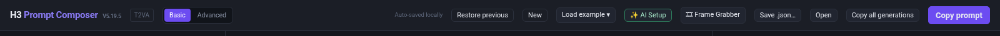

# H3 Prompt Composer

**Version 5.19.5**

A free, standalone prompt-building tool for **MiniMax H3** video generation, designed primarily for **ComfyUI** reference workflows.

**Single HTML file - no installation - runs locally in your browser**

## ▶ Tutorial

**▶ [Watch the H3 Prompt Composer Tutorial on YouTube](https://youtu.be/Dpu-V7lITZk)**

> Click the image above to open the video tutorial on YouTube.

> **Screenshot note:** Most feature screenshots below were captured from V5.19.4 because V5.19.5 intentionally leaves those interfaces unchanged. The project-save control is shown separately with a fresh V5.19.5 capture.

H3 Prompt Composer turns filmmaking-oriented choices - Subjects, references, Shots, timing, camera behavior, dialogue, continuity, editing, and audio - into structured H3 prompts while checking for common structural conflicts and offering lightweight H3-focused prompt coaching.

## What's New in V5.19.5

V5.19.5 is the final project-save polish release. Prompt generation and the six built-in workflow outputs are unchanged from V5.19.4.

- **Save .json now behaves like a normal project Save As command in supported Chromium browsers.** Clicking it opens the system file picker so you can choose the filename and project folder before writing the JSON.
- If the native file-system picker is unavailable, the Composer keeps the older browser-download behavior as a compatibility fallback instead of breaking project export.
- Canceling the Save As dialog performs no download or write.
- V5.19.4 project state and Restore Previous backups migrate directly into V5.19.5.
- The standalone HTML received another full syntax, runtime, layout, security, migration, Save As/fallback, and built-in prompt-regression audit.

V5.19.4 introduced the final community-feedback UX polish: Check **Locate** buttons, disclosure chevrons, a bottom **+ Add Shot** workflow, easier retention discoverability, and horizontal-overflow hardening. V5.19.3 introduced the expanded Prompt Check, deterministic Prompt Coach, Adherence Guide, canonical `<Subject N>` checks, reference-ownership analysis, refined scale/continuity language, and AI-import cleanup.

Full details are in the [V5.19.5 changelog](H3_Prompt_Composer_V5_19_5_CHANGELOG.md).

## What It Supports

- **T2VA** - text-to-video
- **I2VA** - start from an image
- **FL2VA** - first-frame to last-frame generation
- **L2VA** - generate toward a required final image
- **Ref2VA** - character, environment, Picture, Video, and Audio reference workflows

Ref2VA includes reusable Subjects, multi-view Environments, voice mapping, appearance continuity, visual scale/placement guidance, previous-generation continuity references, endpoint-first camera controls, Timed Action Beats, AI-assisted project setup, and guided source-video workflows.

## Quick Start

1. Open `H3_Prompt_Composer_V5_19_5.html` in a modern browser.
2. Choose the H3 mode you are using.
3. Set duration and style.
4. In Ref2VA, set **Connected ComfyUI inputs** to match the physical Images / Videos / Audio sockets you connected.
5. Add only Subjects and references that have a clear job.
6. Build the Generation from one or more Shots.
7. Add Timed Action Beats, camera, dialogue, and sound as needed.
8. Review **Prompt Check** for structural/configuration problems.
9. Review **Suggestions** for H3 adherence or prompt-clarity coaching when any cards appear.
10. Click **Copy prompt** and paste the result into your H3 prompt field in ComfyUI.

> **The Composer is not a media loader.** It does not load the images, videos, or audio connected to ComfyUI. It describes how those already-connected inputs should be interpreted.

## Connected ComfyUI Inputs

The Images / Videos / Audio counts represent the physical reference slots connected in ComfyUI. They make the corresponding Picture / Video / Audio choices available in the Composer.

These counts are separate from Subject numbers. A Subject label such as `<Subject 3>` is a stable semantic identity; a Picture slot such as `<Picture 5>` is a physical H3/ComfyUI input that may be reused by different inactive library alternatives.

Current limits encoded into Prompt Check are up to **9 images, 3 videos, 3 standalone audio clips, and 12 mixed reference files total**. Reference video/audio clips are checked against the Composer's current H3 duration limits, and total prompt length is checked against the 7,000-character ceiling.

## The Timeline Model

A **Generation** is one complete H3 output. A **Shot** is one continuous camera view inside that Generation. A **Timed Action Beat** is a timed action window inside one continuous Shot.

Use a new Shot only when the camera actually cuts or transitions to another view. If the camera stays continuous and only the action pacing changes, use Timed Action Beats.

For long Generations, you can add a Shot from either the top Shot toolbar or the **+ Add Shot** control below the final Shot. The Composer collapses the prior cards, creates the next Shot, scrolls it into view, and focuses **Opening State**.

H3 duration is requested from **4-15 seconds**. At 24 fps, the Composer normalizes the result to the valid **17n+5 frame** sequence. For example, a requested 10.00 seconds becomes 243 frames, or an effective 10.13 seconds.

## Generated Prompt Structure

T2VA, I2VA, FL2VA, and L2VA produce an `integrated_multimodal_description`.

Ref2VA uses six top-level sections:

- `subject_definitions`
- `summary`
- `retention_analysis`
- `detailed_description`
- `overall_soundscape`
- `non_diegetic_music`

The Composer owns this skeleton. Enter the content of each filmmaking field rather than pasting raw `[Shot N]`, `<d>`, retention blocks, or top-level field labels into Action/Opening text.

## Canonical Reference Labels

In Ref2VA instructional prose, prefer the exact Composer labels:

> `<Subject 1> runs toward <Subject 2>.`

rather than:

> `Jane runs toward John.`

The human-readable names remain useful in Subject definitions and the UI, but `<Subject N>` is the stable routing label used across the structured H3 prompt. Prompt Check can recognize known Subject names and common malformed forms such as `Subject 1`, `<Subject1>`, or raw `S1` in normal Shot instructions.

Literal dialogue and on-screen text are intentionally different: a character may genuinely say or display a name, so those fields are not rewritten as Subject labels.

## References: Give Every Input One Clear Job

A Subject is a reusable character/person, creature, vehicle, prop, Environment, or other visual element. Attach the image/video references that define that Subject inside the Subject card.

Standalone Pictures are reserved for jobs such as:

- composition anchors
- storyboard references
- previous-generation continuity
- wardrobe transfer
- visual height / scale / placement
- lighting-integration guidance
- environment-state continuity
- exact first/key/last/edited keyframes

A useful mental model for complex Ref2VA work is:

**source -> contribution -> target -> boundaries**

The Composer tries to make that relationship explicit so two references do not silently compete for the same attribute.

### Preservation / retention strength

Basic mode shows the effective preservation marker for each reference so you can see whether it is `fully_preserved`, `partially_preserved`, `attribute_transfer`, `weak_reference`, or an audio-specific copy/reference marker. For editable references, **Edit in Advanced** jumps directly to the full selector. Specialized roles such as scale guidance and previous-generation continuity intentionally use fixed transfer/preservation behavior.

### Multi-view Environments

If several Pictures show complementary angles of the same location, select them all inside **one Environment Subject**. The Environment reference defines the stable place and layout; Camera Builder still defines the target Shot framing.

Picture numbers on an Environment are temporary routing for that Environment, not permanent IDs for its source images. If Pictures 1-4 are pinned Subject references, three alternative Environments can legally route as:

- Jungle Clearing: Pictures 5-6
- Jungle Road: Picture 5
- Broken Bridge: Pictures 5-7

The same slot may be reused by different inactive Environment library entries because only the selected Environment is connected for a Generation. Multiple views used together inside one Environment still need distinct physical slots.

Advanced users can also use a Picture more loosely when that is intentional, but the Composer still recommends declaring what the image contributes and what remains authoritative elsewhere. For example, a composition Picture can contribute character/setting evidence while the current Opening State and Camera Builder deliberately establish new blocking and framing. Use Advanced preservation/transfer settings rather than treating a loose reference as an exact frame anchor.

Use slot-independent names such as `ENV03_BrokenBridge_V02_APPROACH.png`. Reserve a `P##` prefix for media intentionally pinned to a physical Picture input.

## Previous-Generation Continuity

Use a **Previous-generation continuity** Picture when a successful earlier Generation contains state that should survive into the next one.

Choose what the screenshot should preserve:

- Subject starting position / blocking
- Object or vehicle position / orientation
- Environment state / local geography
- Visible appearance / physical state
- Broad scene state / spatial relationships

For blocking continuity, the Composer treats the screenshot as an **environment-relative spatial-state reference**. Unless **Preserve approximate camera framing too** is enabled, the current Shot camera reconstructs that state from a new viewpoint rather than copying the screenshot's composition.

Crop or clean continuity screenshots so visible old state supports the job you actually want. Old blocking that should not survive can become competing evidence.

## Visual Height / Scale / Placement

Use text-only height relationships when possible. When stronger visual guidance is needed, add a **Visual height / scale / placement** Picture.

### Height / scale only - safest

This mode transfers the **relative overall physical size / standing-height relationship** among the mapped Subjects. The left-to-right list is for **figure identification only** and does not define target blocking.

The Subjects' own references remain authoritative for identity, anatomy, individual body proportions, wardrobe, and appearance. The current Shot and Environment control position, spacing, depth, pose, perspective, lighting, and final composition.

### Height / scale + approximate placement

This mode additionally allows the Picture to guide approximate left-to-right relationship, spacing, depth, floor contact, and blocking in the selected Shot.

The Picture is still an attribute guide, not an exact frame anchor. Prompt Check warns when another continuity Picture is also trying to own placement for the same Subjects.

## Camera Builder

The Camera Builder is endpoint-first:

1. **Start Frame** - opening framing, Subject(s), viewpoint, height, composition.
2. **End Frame** - keep the same relationship or define a different endpoint.
3. **Camera Motion** - choose a physically compatible move and timing.

Advanced controls include movement range/speed, stabilization, lens perspective, depth of field, focus behavior, rack focus, and custom camera instructions.

When a Video reference is explicitly assigned to transfer camera motion, Suggestions can flag a separately authored Camera Builder move as a second camera authority so you can confirm whether both are intentionally aligned.

## Dialogue and Audio

Bind voice references once at the Subject level. Dialogue cards define the speaker, delivery, language, exact spoken words, optional voice behavior, and post-line action.

Audio purposes include voice timbre, exact performed dialogue, exact/reused source audio, music style, and sound texture. Voice references can use Auto behavior so an unused voice is bypassed in a Generation without consuming an H3 `<Audio N>` label.

Dialogue linked to a short Timed Action Beat can receive an advisory timing estimate when the line appears much longer than the assigned window.

## Soundscape and Music

The Composer separates scene sound from audience-only music.

- **Base soundscape** can carry into a fresh Generation.
- **Additional sounds this Generation** are clip-specific and do not automatically carry forward.
- **No scene sound / silence** means no dialogue, ambience, or physical sound; non-diegetic music is controlled separately.
- **Non-diegetic music** is the audience-only score.

Use the dedicated status controls for intentional silence or `N/A` music rather than burying broad negative instructions such as "no background music" inside prose.

## Prompt Check

Prompt Check is the high-confidence preflight system:

- **Error** - fix before generating.
- **Warning** - review the relationship/timing; change it when it is not intentional.
- **Info** - useful context or guidance.

It validates structural, timing, reference, dialogue, audio, camera, continuity, mapping, and workflow state. It can catch issues such as missing/overlapping Timed Beats, stale camera targets, invalid voice bindings, inactive references, physical-slot collisions, malformed canonical labels, incompatible reference roles, and several common exact-frame/continuity conflicts.

When a Check result has a clear source control, a **Locate** button jumps to that field and briefly highlights it. This includes many Shot, camera, continuity, dialogue, appearance, audio, reference, timing, and connected-input problems. Some project-wide messages do not have a single unique field and therefore remain informational only.

A clean Prompt Check means the Composer does not see a known structural conflict; it cannot guarantee that the generative model will follow every instruction perfectly.

## Suggestions and Prompt Coach

Suggestions run automatically and never block prompt output. They combine two kinds of review:

- **H3 adherence / relationship findings** - evidence-backed or strongly structured cases such as ambiguous turn-away language, generic quality-token prose, soft audio negatives, weak cuts, competing camera ownership, and role conflicts.
- **Prompt Coach** - lightweight deterministic coaching that uses field context to catch things such as Opening/Action duplication, bare locomotion, under-specified orientation, ambiguous multi-Subject pronouns, thin object interaction, or dialogue timing pressure.

When a card appears:

- **Locate** jumps to the relevant field.
- **Why?** opens the related Adherence Guide section when available.
- **Dismiss** hides a suggestion that does not apply to your intent.

A blank Suggestions tab means only that the current rule set found no known issue. It is not a claim that every possible prose problem has been proven absent.

## H3 Adherence Field Guide and Phrase Bank

The built-in guide summarizes the H3-specific prompting principles used by the Suggestions engine, including:

- terse/exact schema vs. explicit physical descriptions
- turn-away/orientation stress cases
- negative phrasing and dedicated fields
- observable behavior vs. empty quality-booster language
- reference jobs and ownership
- canonical labels in instructional prose
- cuts vs. camera moves
- resolution/adherence observations
- single-variable retry discipline

The **Phrases** tab is a static phrase bank, not an AI rewrite system. Clicking a phrase copies it as an example of useful H3 register; it does not automatically insert or rewrite your current prompt.

## AI Setup and Import

**AI Setup** copies project-building instructions and a schema-v4 JSON example for use with an external LLM. The LLM can identify Subjects, Environment views, Generations, Shots, actions, and dialogue, then return structured JSON for import.

The import model separates two concepts:

- **Library identity** - the stable semantic identity of a character sheet or Environment view.
- **Physical routing** - the temporary `<Picture N>` socket used when a particular Generation is rendered.

Upload order, a phrase such as "image 10," or `ENV03/V03` in a filename does not establish Picture 10 or Picture 3. Only an intentional physical-slot instruction fixes a slot. Review imported Environment routing against the inputs you intend to connect before generating.

V5.19.4 also removes completely empty imported Timed Action Beats unless they are intentionally referenced as dialogue timing windows.

## Guided Video Workflows

### Insert a Subject Into Existing Footage

Treat the source Video as the plate and preserve its timing, camera, parallax, Environment, and unaffected content while physically integrating the new Subject. Optional multi-Subject scale/placement guidance can communicate apparent size and rough blocking.

### Background Replacement + Relighting

Replace a green/blue/plain/existing background while preserving the performer and source framing, then rebuild the performer's directional lighting and reflected Environment color.

An optional **Lighting / Integration Reference** can show a preferred relit still. It transfers lighting/integration relationships without copying pose, framing, placement, or background geometry.

The workflow also supports **Relight existing composite only** for an externally composited source whose background is already correct but whose performer still needs Environment-matched lighting.

### Performance / Camera Transfer

Transfer selected facial acting, mouth performance, head movement, eyeline, gesture, full-body motion, and/or camera movement from a filmed reference while the target Subject references remain authoritative for identity/appearance.

**Dialogue is optional.** Choose **No dialogue / no audio reference** for movement/acting/camera transfer with no spoken line.

### Continue an Existing Video

Use the source Video as a temporal handoff. The source clip ends and the target begins immediately afterward - it is not a frame-for-frame edit.

Continuation can preserve Subject momentum/screen direction, camera direction/speed/height/framing momentum, Environment/lighting/spatial continuity, and can explicitly prevent replaying or resetting the source ending.

## Built-In Examples

Use **Load example** for working templates:

- Full reference scene
- Insert a subject into existing footage
- Background replacement + relighting
- Performance + camera transfer
- Continue an existing video
- Simple text-to-video shot

## Saving Projects

- **Auto-saved locally** stores the current project in browser local storage.
- **Save .json…** opens a Save As dialog in supported Chromium browsers so you can choose the filename and folder. Browsers without that API fall back to their normal download behavior.
- **Open** loads a saved project JSON.
- **Restore previous** restores the safety backup made before destructive preset/example/reset changes.
- **Copy prompt** copies the active Generation.
- **Copy all generations** copies the complete multi-Generation sequence.

V5.19.5 migrates V5.19.4, V5.19.3, V5.19.2 TEST, V5.19.1 TEST, V5.19.0, and earlier local projects/backups forward without silently rewiring existing Picture routing.

## Privacy and Security

H3 Prompt Composer V5.19.5 is designed to run locally.

The audited V5.19.5 HTML:

- contains no external JavaScript or stylesheet dependencies
- does not use `fetch()`, XMLHttpRequest, WebSockets, EventSource, or `sendBeacon`
- does not use `eval()` or downloaded executable code
- does not contain external HTTP/HTTPS URLs
- does not require an account or server connection

Normal browser features are used for local project storage, clipboard copy, loading user-selected JSON/media for local helper tools, and saving local project files.

The complete application source is contained in the HTML file and can be inspected directly on GitHub.

## Documentation

- **[Full V5.19.5 User Guide](H3_Prompt_Composer_V5_19_5_User_Guide.pdf)** - complete workflow reference.
- **[V5.19.5 Illustrated User Guide](H3_Prompt_Composer_V5_19_5_Illustrated_User_Guide.pdf)** - visual quick-start and feature tour using current screenshots.
- [`H3_Prompt_Composer_V5_19_5_CHANGELOG.md`](H3_Prompt_Composer_V5_19_5_CHANGELOG.md) - release notes, compatibility, known scope, and QA results.
- `H3_Prompt_Composer_V5_19_5_SHA256.txt` - checksum for the standalone V5.19.5 HTML.

## What the Composer Does Not Do

H3 Prompt Composer does not run MiniMax H3, upload your reference media, change your ComfyUI workflow, choose your model/sampler settings, or guarantee model compliance. Suggestions are a deterministic offline assistant, not a language model or replacement for creative judgment.

Its job is to build a clear, internally consistent prompt from filmmaking-oriented controls, make reference ownership explicit, and catch common structural or wording mistakes before generation.

## Version

**H3 Prompt Composer V5.19.5**

V5.19.5 keeps the polished V5.19 feature set intact and adds project-folder-aware Save As behavior where the browser supports it, with a compatibility fallback for browsers that do not.

## Disclaimer

H3 Prompt Composer is an independent community tool and is not an official MiniMax or ComfyUI product.