# H3 Prompt Composer

**Version 5.18.5**

A free, standalone prompt-building tool for **MiniMax H3** video generation, designed primarily for **ComfyUI** reference workflows.

**Single HTML file - no installation - runs locally in your browser**

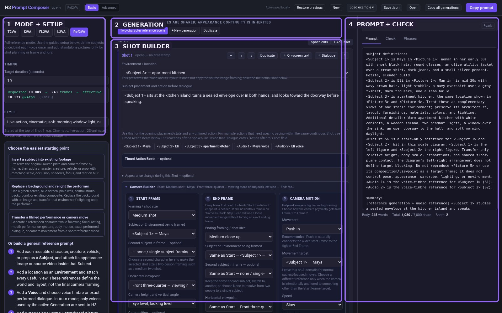

H3 Prompt Composer turns filmmaking-oriented choices - Subjects, references, Shots, timing, camera behavior, dialogue, continuity, editing, and audio - into structured H3 prompts while checking for common conflicts.

## What's New in V5.18.5

V5.18.5 formalizes the difference between a persistent project-media identity and a temporary physical H3/ComfyUI Picture input.

- Environment Pictures can reuse the same physical slots across different Environments and Generations.
- The AI Setup workflow now teaches reusable routing directly, including the `5-6 / 5 / 5-7` pattern.
- Environment views can carry stable human-readable names through AI import and export.
- Validation permits cross-Environment slot reuse while rejecting duplicate slots inside one Environment.
- Upload order, conversational labels, and `ENV##/V##` filename numbering no longer imply a physical Picture slot.
- Existing projects retain their current wiring during migration; V5.18.5 never silently rewires them.
- All six built-in workflow prompts remain byte-for-byte identical to V5.18.4.

The full audit and compatibility notes are in the [V5.18.5 changelog](H3_Prompt_Composer_V5_18_5_CHANGELOG.md).

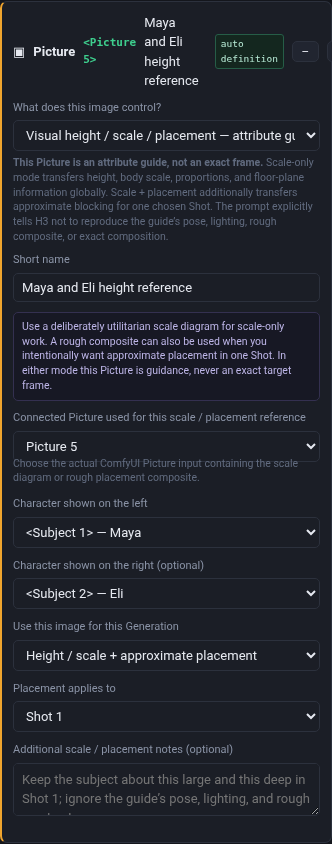

## What It Supports

- **T2VA** - text-to-video
- **I2VA** - start from an image
- **FL2VA** - first-frame to last-frame generation
- **L2VA** - generate toward a required final image
- **Ref2VA** - character, environment, Picture, Video, and Audio reference workflows

Ref2VA includes reusable Subjects, multi-view Environments, voice mapping, appearance continuity, visual scale/placement guidance, camera controls, Timed Action Beats, and guided source-video workflows.

## Quick Start

1. Open `H3_Prompt_Composer_V5_18_5.html` in a modern browser.
2. Choose the H3 mode you are using.
3. Set duration and style.
4. In Ref2VA, set **Connected ComfyUI inputs** to match the physical Images / Videos / Audio sockets you connected.
5. Add only the Subjects and references that have a clear job.
6. Build the Generation from one or more Shots.
7. Add Timed Action Beats, camera, dialogue, and sound as needed.
8. Read **Prompt Check**.
9. Click **Copy prompt** and paste the result into your H3 prompt field in ComfyUI.

> **The Composer is not a media loader.** It does not load the images, videos, or audio connected to ComfyUI. It describes how those already-connected inputs should be interpreted.

## Connected ComfyUI Inputs

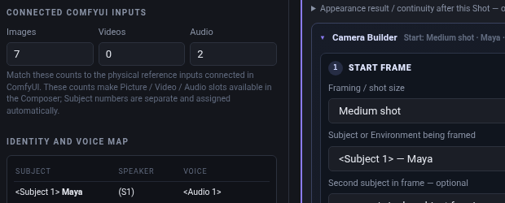

The Images / Videos / Audio counts represent the physical reference slots connected in ComfyUI. They make the corresponding Picture / Video / Audio choices available in the Composer.

These counts are separate from Subject numbers. A single Environment Subject may use multiple Picture slots when those images are complementary views of the same location.

Current H3 reference limits used by Prompt Check are up to **9 images, 3 videos, 3 standalone audio clips, and 12 mixed reference files total**. Reference video/audio clips are 2-15 seconds each, with a 15-second combined limit per modality; the prompt ceiling is 7,000 characters.

## The Timeline Model

A **Generation** is one complete H3 output. A **Shot** is one continuous camera view inside that Generation. A **Timed Action Beat** is a timed action window inside one continuous Shot.

Use a new Shot only when the camera actually cuts or transitions to another view. If the camera stays continuous and only the action pacing changes, use Timed Action Beats.

## References: Give Every Input One Clear Job

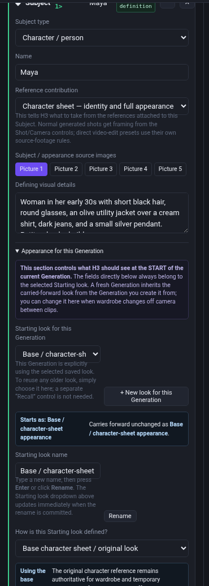

A Subject is a reusable character/person, creature, vehicle, prop, Environment, or other visual element. Attach the image/video references that define that Subject inside the Subject card.

Standalone Pictures are reserved for jobs such as:

- composition anchors
- storyboard references
- wardrobe transfer
- Environment-state continuity
- visual height / scale / placement
- lighting-integration guidance
- exact first/key/last/edited keyframes

The optional Subject source-video section is shown only when Video inputs are actually configured.

### Multi-view Environments

If several Pictures show complementary angles of the same location, select them all inside **one Environment Subject**. The Environment reference defines the stable place and layout; Camera Builder still defines the target shot framing.

Picture numbers on an Environment are temporary routing for that Environment, not permanent IDs for its source images. If Pictures 1-4 are pinned Subject references, three alternative Environments can legally route as:

- Jungle Clearing: Pictures 5-6
- Jungle Road: Picture 5
- Broken Bridge: Pictures 5-7

The same slot may be reused by different Environments because only the active Environment is connected for that Generation. Multiple views used together inside one Environment still need distinct slots.

Use slot-independent names such as `ENV03_BrokenBridge_V02_APPROACH.png`. Reserve a `P##` prefix for media intentionally pinned to a physical Picture input.

## AI Setup and Import

**AI Setup** copies project-building instructions and a schema-v4 JSON example for use with an LLM. The AI can identify Subjects, Environment views, Generations, Shots, actions, and dialogue, then return structured JSON for import.

The import model separates two concepts:

- **Library identity** - the stable semantic identity of a character sheet or Environment view.
- **Physical routing** - the temporary `<Picture N>` socket used when a particular Generation is rendered.

Upload order, a phrase such as "picture 10," or `ENV03/V03` in a filename does not establish Picture 10 or Picture 3. Only an intentional `P##` filename prefix or an explicit physical-slot instruction fixes a slot. Review imported Environment routing against the inputs you intend to connect before generating.

## Appearance and Wardrobe Continuity

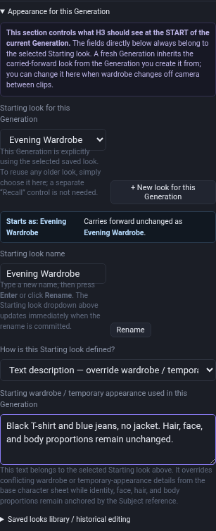

**Starting look for this Generation** is the authoritative opening appearance.

When wardrobe changes between clips, click **+ New look for this Generation**, give it a meaningful name, and define the wardrobe/temporary appearance with text or a dedicated Picture. Press **Enter** or click **Rename** to commit a new look name; the dropdown updates immediately.

The **Saved looks library / historical editing** section manages reusable looks, but it does not select the current Generation's appearance. Earlier Generations are protected when a shared look is edited later.

For a visible wardrobe change inside a Shot, describe the actual action in the Shot or Timed Action Beats, then use **Appearance after this Shot** to carry the resulting look into later Shots/Generations. The Composer avoids redundantly restating an obvious end state.

## Visual Height / Scale / Placement

Use text-only height relationships when possible. When stronger visual guidance is needed, add a **Visual height / scale / placement** Picture.

### Subjects shown in this reference - from left to right

List the visible Subjects in the same order they appear in the image. For example:

1. Jane
2. John
3. T-Rex
4. Jeep

The Composer turns that into explicit mapping language such as:

> Within this guide, from left to right, the subjects shown are `<Subject 1>` Jane, `<Subject 2>` John, `<Subject 4>` T-Rex, and `<Subject 3>` Jeep.

The Subject numbers do **not** need to increase from left to right. They are the stable Subject labels assigned elsewhere in the project; the ordered list tells H3 where those already-defined Subjects appear in this particular guide. This prevents H3 from having to guess which figure corresponds to which Subject.

- **Height / scale only - safest** transfers relative physical size, body/object scale, proportions, and shared floor-plane contact. The ordered list identifies the figures but does **not** define target blocking.
- **Height / scale + approximate placement** also transfers approximate left-to-right order, spacing, depth, floor contact, and screen placement for one selected Shot.

The guide remains an attribute source, not an exact target frame. Pose, wardrobe, lighting, image style, and rough-composite artifacts are explicitly excluded.

## Camera Builder

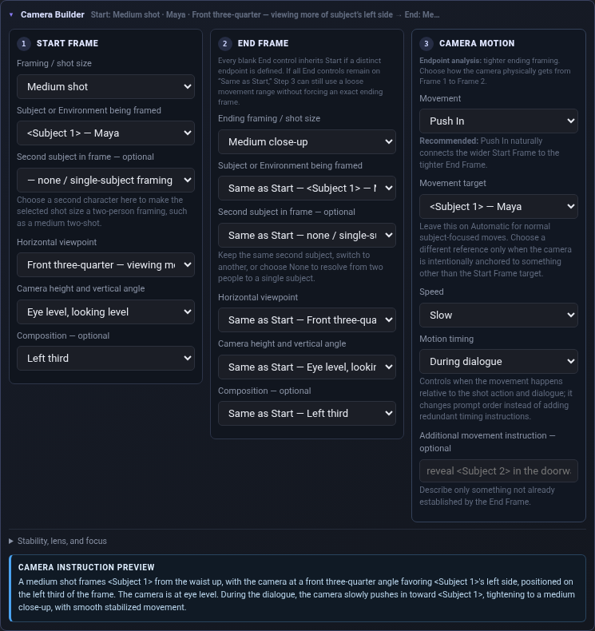

The Camera Builder is endpoint-first:

1. **Start Frame** - opening framing, Subject(s), viewpoint, height, composition.
2. **End Frame** - keep the same relationship or define a different endpoint.
3. **Camera Motion** - choose a physically compatible move and timing.

Advanced controls include movement range/speed, stabilization, lens perspective, depth of field, focus behavior, rack focus, and custom camera instructions.

## Dialogue and Audio

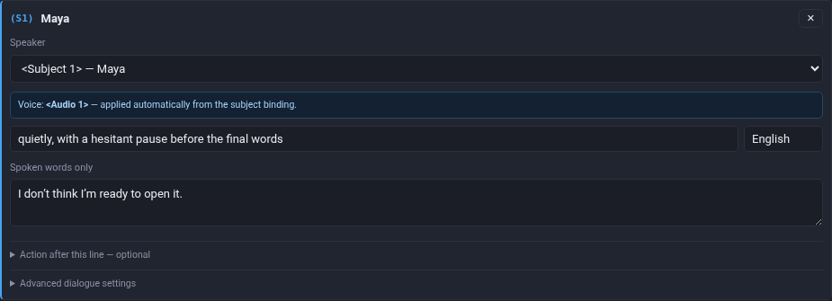

Bind voice references once at the Subject level. Dialogue cards define the speaker, delivery, language, exact spoken words, optional voice behavior, and post-line action.

Audio purposes include voice timbre, exact performed dialogue, exact/reused source audio, music style, and sound texture. Voice references can use Auto behavior so an unused voice is bypassed in a Generation without consuming an H3 `<Audio N>` label.

## Guided Video Workflows

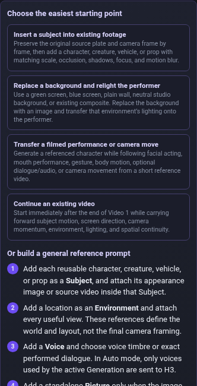

### Insert a Subject Into Existing Footage

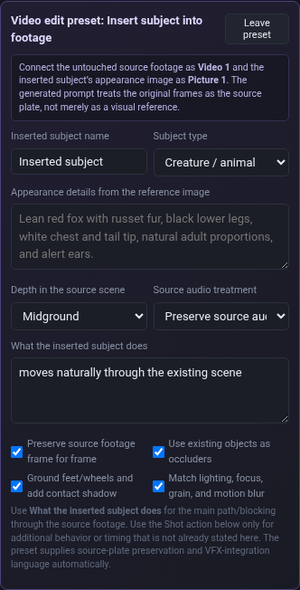

Treat Video 1 as the source plate and preserve its timing, camera, parallax, Environment, and unaffected content while physically integrating the new Subject. Optional multi-Subject scale/placement guidance can communicate apparent size and rough blocking.

### Background Replacement + Relighting

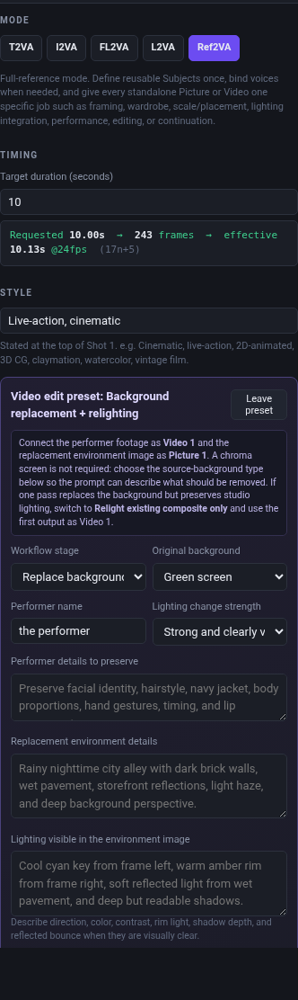

Replace a green/blue/plain/existing background while preserving the performer and source framing, then rebuild the performer's directional lighting and reflected Environment color.

An optional **Lighting / Integration Reference** can show a preferred relit still. It transfers lighting/integration relationships without copying pose, framing, placement, or background geometry.

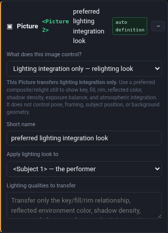

The workflow also supports **Relight existing composite only** for an After Effects/composited source whose background is already correct but whose performer still needs Environment-matched lighting.

### Performance / Camera Transfer

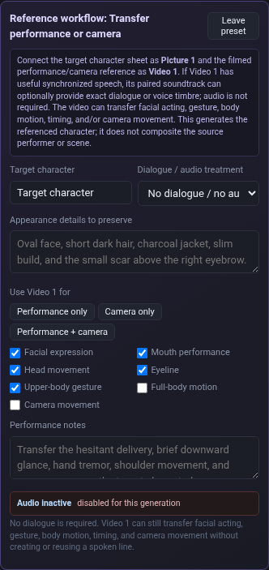

Transfer selected facial acting, mouth performance, head movement, eyeline, gesture, full-body motion, and/or camera movement from a filmed reference while the target Subject references remain authoritative for identity/appearance.

**Dialogue is optional.** Choose **No dialogue / no audio reference** for movement/acting/camera transfer with no spoken line.

### Continue an Existing Video

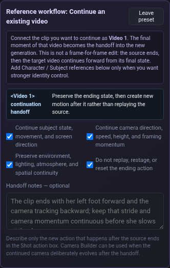

Use Video 1 as a temporal handoff. The source clip ends and the target begins immediately afterward - it is not a frame-for-frame edit.

Continuation can preserve Subject momentum/screen direction, camera direction/speed/height/framing momentum, Environment/lighting/spatial continuity, and can explicitly prevent replaying or resetting the source ending.

## Soundscape and Music

The Composer separates scene sound from audience-only music.

- **Base soundscape** can carry into a fresh Generation.
- **Additional sounds this Generation** are clip-specific and do not automatically carry forward.
- **No scene sound / silence** means no dialogue, ambience, or physical sound; non-diegetic music is controlled separately.
- **Non-diegetic music** is the audience-only score.

## Prompt Check

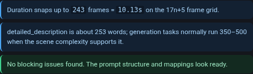

Prompt Check is a preflight panel:

- **Error** - fix before generating.
- **Warning** - review the relationship/timing; change it when it is not intentional.
- **Info** - useful context or guidance.

For multi-Subject scale/placement guides, Prompt Check also catches an empty Subject list, invalid Subjects, duplicate Subject assignments, and invalid placement-Shot targets.

A clean Prompt Check means the Composer does not see a structural conflict; it cannot guarantee that the generative model will follow every instruction perfectly.

## Built-In Examples

Use **Load example** for working templates:

- Full reference scene
- Insert a subject into existing footage
- Background replacement + relighting
- Performance + camera transfer
- Continue an existing video
- Simple text-to-video shot

## Saving Projects

- **Auto-saved locally** stores the current project in browser local storage.
- **Save .json** exports a portable editable project.
- **Open** loads a saved project JSON.
- **Restore previous** restores the safety backup made before destructive preset/example/reset changes.
- **Copy prompt** copies the active Generation.
- **Copy all generations** copies the complete multi-Generation sequence.

V5.18.5 migrates supported older projects forward without silently changing existing Picture routing. Environment view names and contribution roles survive AI export/import.

## Privacy and Security

H3 Prompt Composer V5.18.5 is designed to run locally.

The audited V5.18.5 HTML:

- contains no external JavaScript or stylesheet dependencies
- does not use `fetch()`, XMLHttpRequest, WebSockets, EventSource, or `sendBeacon`
- does not use `eval()` or downloaded executable code
- does not contain external HTTP/HTTPS URLs
- does not require an account or server connection

Normal browser features are used for local project storage, clipboard copy, loading user-selected JSON files, and saving local project files.

The complete application source is contained in the HTML file and can be inspected directly on GitHub.

## Documentation

- **[Full V5.18.5 User Guide](H3_Prompt_Composer_V5_18_5_User_Guide.pdf)** - detailed reference for every major workflow, AI Setup, reusable Environment routing, and continuity system.
- **[V5.18.5 Illustrated User Guide](H3_Prompt_Composer_V5_18_5_Illustrated_User_Guide.pdf)** - visual quick-start guide using interface screenshots and routing examples.
- [`H3_Prompt_Composer_V5_18_5_CHANGELOG.md`](H3_Prompt_Composer_V5_18_5_CHANGELOG.md) - release changes and QA notes.
- `H3_Prompt_Composer_V5_18_5_SHA256.txt` - checksum for the standalone HTML.

## What the Composer Does Not Do

H3 Prompt Composer does not run MiniMax H3, upload your reference media, change your ComfyUI workflow, choose your model/sampler settings, or guarantee model compliance. Its job is to build a clear, internally consistent prompt from filmmaking-oriented controls and catch common structural mistakes before generation.

## Version

**H3 Prompt Composer V5.18.5**

V5.18.5 is the reusable Environment-routing and AI-setup release. It preserves established prompt generation while separating stable media identity from temporary physical Picture routing, adds named Environment views to AI interchange, and strengthens validation around legal slot reuse.

## Disclaimer

H3 Prompt Composer is an independent community tool and is not an official MiniMax or ComfyUI product.
