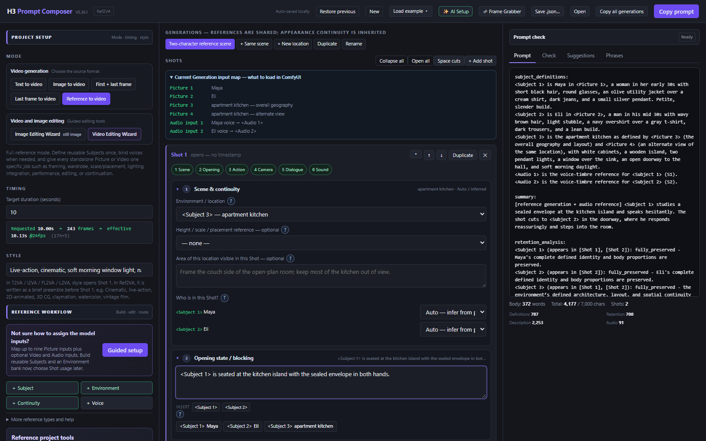
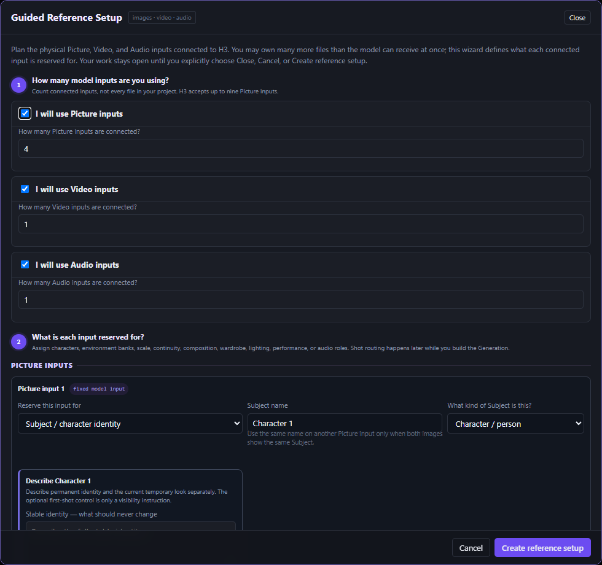
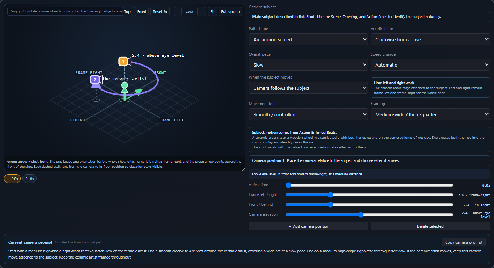
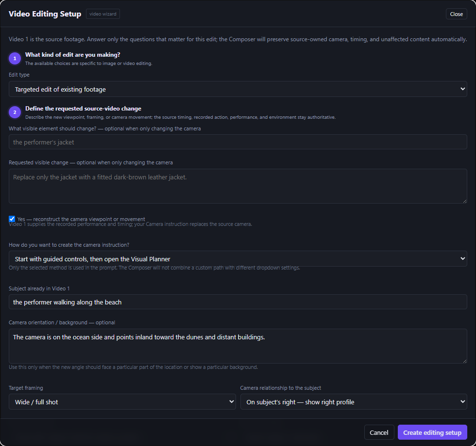
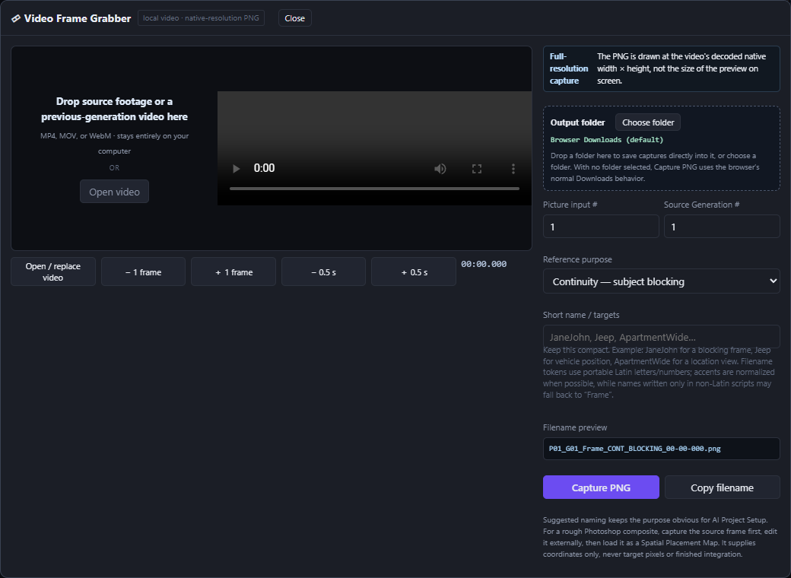
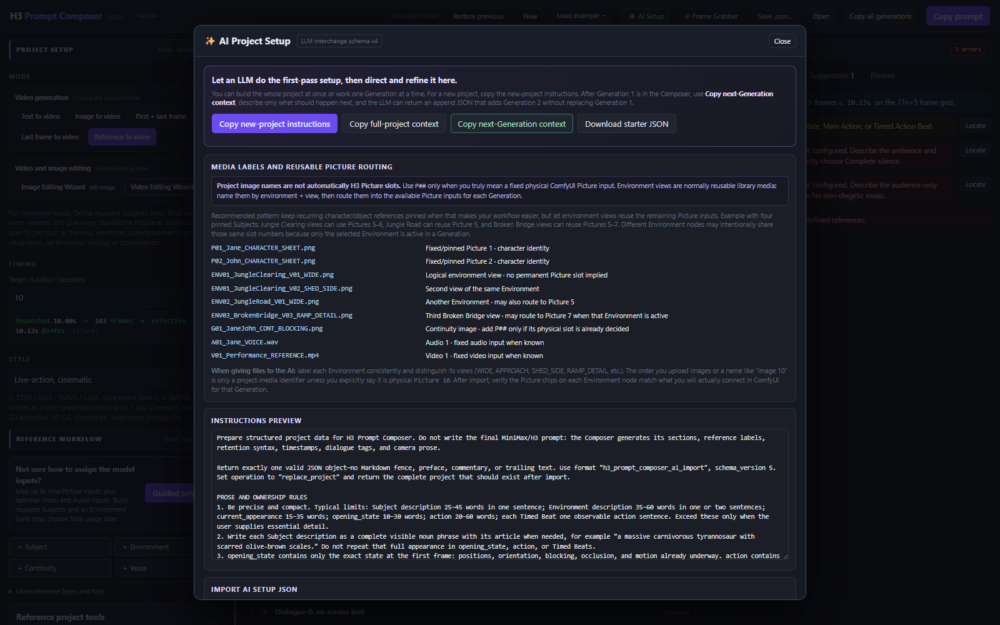
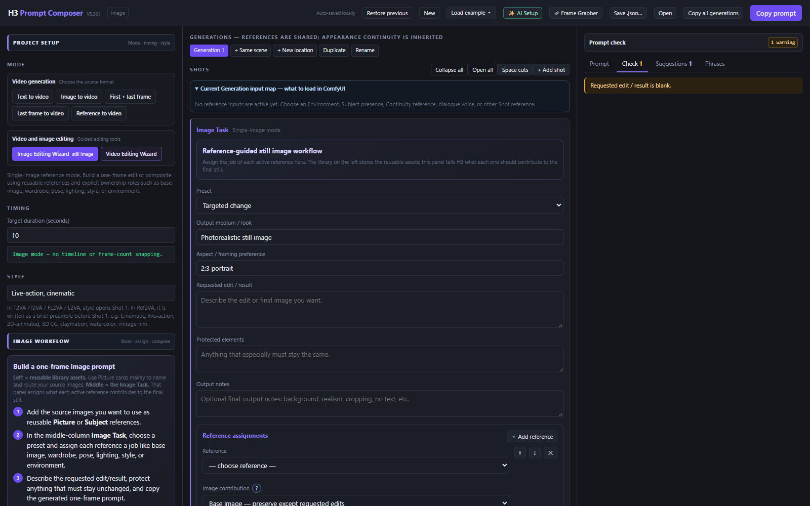
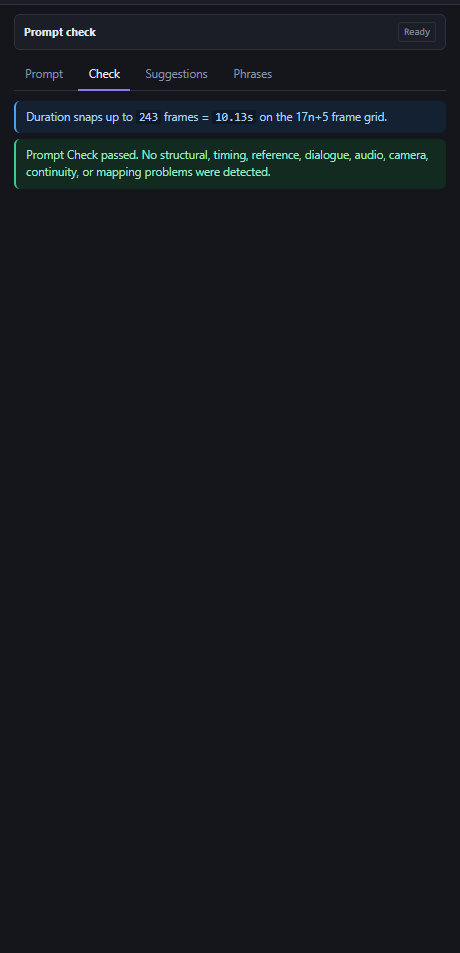

# H3 Prompt Composer

**Version 5.36.1**

A free, standalone prompt-building tool for **MiniMax H3** video generation and reference-guided image work, designed primarily for **ComfyUI** workflows.

**One HTML file - no installation - runs locally in your browser**



H3 Prompt Composer turns filmmaking choices - references, environments, Shots, timing, camera behavior, dialogue, continuity, editing, and audio - into structured H3 prompts. It also checks common structural conflicts and offers deterministic, offline prompt coaching.

## What's new in V5.36.1

V5.36.1 is the new publication candidate after the repository's previous V5.19.5 release.

- **Targeted Edit camera reconstruction now produces a shorter affirmative prompt.** The camera instruction leads, one optional orientation/background cue disambiguates the new view, and defensive mirror/world-geometry language has been removed.
- **Exactly one camera-authoring method is active in Targeted Edit:** Guided camera controls, Visual Planner, or one custom camera instruction.
- **Visual Planner** converts timed camera positions, straight or arc paths, and subject-relative or scene-space behavior into one natural camera instruction.
- **Guided Reference Setup** begins with the physical Picture, Video, and Audio inputs and reserves each input for a clear job.
- **Video Editing Setup** now covers subject insertion, subject replacement, targeted edits, background replacement and relighting, performance/camera transfer, and video continuation.
- **Spatial Placement Maps**, improved Environment routing, height/scale controls, and continuity references make ownership boundaries more explicit.
- **Frame Grabber** captures local video frames at decoded native resolution and creates purpose-readable PNG filenames.
- **Image mode** builds a separate one-frame reference edit or composite prompt.
- The complete app passed a fresh prompt-guide, runtime, layout, security, migration, and built-in workflow audit.

Full details are in the [V5.36.1 changelog](H3_Prompt_Composer_V5_36_1_CHANGELOG.md).

## Supported workflows

### Video generation

- **T2VA** - text to video
- **I2VA** - begin from a required first image
- **FL2VA** - connect a required first frame to a required last frame
- **L2VA** - generate toward a required final image
- **Ref2VA** - full-reference generation, editing, continuation, and audio workflows

### Reference-guided still images

- Targeted image edit
- Character sheet
- Storyboard sheet
- Head/identity replacement
- Pose/depth transfer
- Wardrobe and location composite
- Style transformation
- General reference composite

Image mode is intentionally separate from the video-prompt grammar.

## Quick start

1. Download and open `H3_Prompt_Composer_V5_36_1.html` in a modern browser.
2. Choose the H3 mode you are using.
3. Set target duration and style.
4. In Ref2VA, set **Connected ComfyUI inputs** to match the physical Images / Videos / Audio sockets you connected.
5. Add only Subjects and references that have a clear job.
6. Build the Generation from one or more Shots.
7. Configure camera, dialogue, Shot Sound, overall soundscape, and music as needed.
8. Review **Check** for structural or configuration problems.
9. Review **Suggestions** for non-blocking H3 adherence and prompt-clarity coaching.
10. Click **Copy prompt** and paste the result into the H3 prompt field in ComfyUI.

> The Composer is not a media loader. It describes how the Picture, Video, and Audio inputs already connected to H3/ComfyUI should be interpreted.

## The three-column workflow

- **Left:** mode, timing, style, connected inputs, and reusable reference library.
- **Center:** Generations, Shots, Opening State, Action, Camera, Dialogue, and Shot Sound.
- **Right:** generated prompt, Check, Suggestions, and phrase references.

References are shared across Generations. Appearance continuity, ambience, and music can carry forward when you create a compatible next Generation.

## Prompt structures

T2VA, I2VA, FL2VA, and L2VA use:

```text
integrated_multimodal_description: [Shot 1] ...

overall_soundscape: ...

non_diegetic_music: ...
```

I2VA, FL2VA, and L2VA prepend the exact required image-alignment instruction.

Ref2VA uses six sections in this order:

```text
subject_definitions:
...

summary:
...

retention_analysis:
...

detailed_description:
...

overall_soundscape:
...

non_diegetic_music:
...
```

The Composer owns these skeletons. Enter filmmaking content into the corresponding controls instead of pasting raw field labels or manual `[Shot N]` blocks into Action fields.

## Generations, Shots, and Timed Action Beats

A **Generation** is one complete H3 output.

A **Shot** is one continuous camera view inside that Generation. Use a new Shot only when the camera cuts or transitions to genuinely new information.

A **Timed Action Beat** is a timed window inside one continuous Shot. Use Beats when actions need explicit pacing but the camera does not cut.

Shot 1 has no timestamp. Every later Shot receives a strictly increasing `MM:SS.mmm` cut time inside the effective video duration.

H3 duration is requested from **4-15 seconds**. At 24 fps, the Composer normalizes it upward to the valid **17n+5 frame** sequence. For example, a requested 10.00 seconds becomes 243 frames, or an effective 10.13 seconds.

## Connected ComfyUI inputs

Connected counts represent physical H3/ComfyUI sockets, not persistent project identities.

Current limits encoded into Check are:

- up to **9 Picture inputs**
- up to **3 Video inputs**
- up to **3 standalone Audio inputs**
- up to **12 mixed reference files total**
- up to **7,000 prompt characters**

A Subject label such as `<Subject 3>` is a stable semantic identity. A Picture label such as `<Picture 5>` is a physical input slot that may be reused by different inactive library alternatives.

## Guided Reference Setup



Guided Reference Setup plans the model inputs before Shot authoring:

1. Choose how many Picture, Video, and Audio inputs are physically connected.
2. Reserve each input for a character, Environment bank, continuity image, scale guide, wardrobe, composition, lighting, performance, or audio role.
3. Create compact reusable library cards.
4. Route the required cards into each Generation and verify the **Current Generation input map**.

You may own more project files than H3 can receive at once. The setup describes the active routing, not the whole archive.

## Canonical Subject labels

In Ref2VA instructional prose, prefer the exact Composer labels:

```text
<Subject 1> runs toward <Subject 2>.
```

Names remain useful in definitions, the interface, literal dialogue, and visible text. The canonical label is the stable routing identity across the generated prompt.

Check recognizes many malformed forms such as `Subject 1`, `<Subject1>`, and raw `S1` in ordinary Shot instructions.

## Reference ownership

Give every active input one clear job:

**source -> contribution -> target -> boundaries**

Common visible-content relationships are:

- `fully_preserved`
- `partially_preserved`
- `attribute_transfer`
- `weak_reference`

Audio uses `fully_copy`, `partially_copy`, `reference`, or `weak_reference`.

Specialized roles such as scale guidance, lighting integration, continuity, and placement keep boundaries that prevent them from silently taking over identity, pose, camera, or finished appearance.

## Environments and continuity

Store complementary views of one location inside one **Environment Subject**. The views define a stable place and layout; Camera controls still define the target Shot framing.

Use slot-independent names such as `ENV03_BrokenBridge_V02_APPROACH.png` unless a file is deliberately pinned to a physical Picture slot.

Use a **Previous-generation continuity** Picture to preserve one defined type of state:

- subject blocking
- object or vehicle position/orientation
- Environment state and local geography
- visible appearance or physical state
- broad scene state and spatial relationships

Crop or edit away stale information that should not carry forward.

## Height, scale, and Spatial Placement Maps

**Height/scale only** transfers the relative overall physical size or standing-height relationship and is the safest option.

**Height/scale + approximate placement** may additionally guide spacing, depth, floor contact, and blocking.

A **Spatial Placement Map** is a coordinate guide only. It can transfer selected position, scale, depth, orientation, grounding, or occlusion relationships, but it does not supply target pixels, finished appearance, or lighting integration.

## Camera Builder and Visual Planner

The Camera Builder is endpoint-first:

1. **Start Frame** - opening framing, target, viewpoint, angle, and composition.
2. **End Frame** - inherit Start or define a distinct endpoint.
3. **Camera Motion** - select a physically compatible path and timing.

Streamlined controls cover common camera choices. Detailed controls add exact Start/End geometry, composition, lens, depth of field, focus behavior, and a custom override.



The Visual Planner lets you:

- place two to six timed camera positions
- choose straight or arc paths
- set pace and easing
- follow a moving subject or stay in scene space
- keep physical subject-left/right relationships stable
- generate one natural camera instruction

In Targeted Edit, **Guided controls, Visual Planner, and Custom instruction are mutually exclusive prompt authorities**.

## Targeted Edit camera reconstruction



Video 1 remains authoritative for recorded performance, subject motion, timing, and location. The selected camera method supplies the new framing, physical viewpoint, movement, and aim.

An optional orientation/background cue names what the new camera should face and what should appear behind the subject. V5.36.1 deliberately keeps this affirmative and concise.

## Guided video editing workflows

### Insert a subject

Preserve the source plate, camera, timing, Environment, and unaffected content while integrating a new Subject with correct scale, grounding, occlusion, focus, and lighting.

### Replace a subject

Replace an existing person, creature, vehicle, or object while inheriting the source performance, timing, contact, and interactions.

### Targeted edit

Change one defined wardrobe, prop, material, damage, color, object, camera, or other visible element while protecting everything else.

### Background replacement + relighting

Replace the recorded background while preserving the performer and source framing, then rebuild directional light, reflected Environment color, shadows, and integration.

### Performance / camera transfer

Transfer selected facial acting, mouth performance, head movement, eyeline, upper-body gesture, full-body motion, dialogue/audio, and/or camera behavior. Target Subject references remain authoritative for identity and appearance.

### Continue an existing video

Start immediately after Video 1 and carry forward momentum, direction, camera behavior, Environment, lighting, and spatial state without replaying or resetting the source ending.

## Dialogue, visible text, and audio

Speaker IDs follow the order of actual vocal events: `(S1)`, `(S2)`, and so on. The same source keeps the same ID across Shots.

Inside `<d>`, the Composer keeps only the language tag and exact spoken words:

```text
<Subject 2> (S1) says: <d>[English] I get off at the next station.</d>
```

- Voiceover uses `says in an off-screen voiceover` and immediately states that on-screen lips remain closed.
- `<scenetrans>` marks dialogue crossing a cut.
- `<cutoff>` marks speech truncated by the end of the video.
- Visible signs, labels, subtitles, and neon text remain in English double quotation marks with their original text.

The Composer separates:

- **Shot Sound** - synchronized one-off sounds
- **overall_soundscape** - ambience, recurring physical sounds, and non-verbal human sounds
- **non_diegetic_music** - audience-only instrumentation, tempo, rhythm, and dynamics

Use `N/A` for no audience-only score. Use scene silence only when there is truly no dialogue, ambience, or physical sound.

## Frame Grabber



The local Frame Grabber:

- opens or accepts dropped MP4, MOV, or WebM footage
- steps by one frame or 0.5 seconds
- captures the decoded native-resolution frame as PNG
- supports direct folder saving when the browser allows it
- creates filenames that include Picture slot, source Generation, reference purpose, and frame time

For a rough composite, capture the source frame, edit it externally, then load it as a Spatial Placement Map.

## AI Project Setup



AI Setup copies schema-v4 instructions and project context for an external LLM. It supports:

- new-project replacement
- full-project context
- next-Generation append
- starter JSON download
- pasted or opened JSON validation
- structural blocking errors and importable Prompt Check findings

Upload order, a phrase such as "image 10," or an Environment filename does not establish a physical Picture slot unless the slot is explicitly assigned. Review imported routing before generation.

## Image mode



Image mode uses reusable references and explicit ownership roles to build one still-image edit or composite. State the requested change, assign each reference a role, and protect everything that must remain source-authentic.

The supplied video-prompt guides govern the five video modes. Image mode is a separate prompt workflow and does not emit the video three-field or six-field structures.

## Prompt Check



Check is the high-confidence preflight system:

- **Error** - fix before generating
- **Warning** - review the relationship or timing
- **Info** - understand normalized or inherited state
- **Pass** - no known structural conflict was found

Locate jumps to the responsible field when one clear source exists.

A clean Check cannot guarantee model compliance. It means the Composer does not see a known structural, timing, reference, dialogue, audio, camera, continuity, or mapping conflict.

## Suggestions, field guide, and phrases

Suggestions run automatically and never block output. They combine H3 relationship checks with deterministic field-aware coaching for issues such as:

- duplicate Opening/Action content
- bare or under-specified movement
- ambiguous orientation or multi-Subject pronouns
- generic quality-booster prose
- prose negatives that belong in dedicated fields
- dialogue timing pressure
- competing camera or reference ownership

The built-in **H3 Adherence Field Guide** explains the evidence and reasoning behind the findings.

The **Phrases** tab is a static register reference. It copies examples; it does not rewrite your prompt.

## Saving and recovery

- **Auto-saved locally** stores the project in browser local storage.
- **Save .json...** opens Save As in supported Chromium browsers and uses a normal download fallback elsewhere.
- **Open** loads a saved project JSON.
- **Restore previous** loads the safety backup created before destructive setup, example, reset, or import actions.
- **Copy prompt** copies the active Generation.
- **Copy all generations** copies the full labeled sequence.

V5.36.1 migrates V5.36.0 projects and backups first, then follows the complete earlier-version fallback chain.

## Privacy and security

H3 Prompt Composer V5.36.1 is designed to run locally.

The audited HTML:

- contains no external JavaScript or stylesheet dependencies
- contains no external resource tags
- does not use `fetch()`, XMLHttpRequest, WebSockets, EventSource, or `sendBeacon`
- does not use `eval()` or dynamic `new Function`
- makes no external network requests during clean loading
- does not require an account or server connection

Normal browser features are used for local storage, clipboard copy, user-selected JSON/media, project saves, and local frame capture.

## Audit summary

The V5.36.1 publication audit found:

- exact base-mode alignment instructions and three-field output structure match the supplied guide
- Ref2VA emits all six required sections in the correct order
- stable speaker, dialogue, scene-transition, cutoff, soundscape, and music rules pass
- all six built-in workflows produce zero Prompt Check errors
- no page exceptions, console errors, internal error bar, or external requests
- no live duplicate DOM IDs
- no horizontal overflow at 390, 1280, 1440, 1920, or 2560 px
- no external resource or network/executable-code APIs listed above

## Documentation

- **[Full V5.36.1 User Guide](H3_Prompt_Composer_V5_36_1_User_Guide.pdf)** - complete workflow and field reference.
- **[V5.36.1 Illustrated User Guide](H3_Prompt_Composer_V5_36_1_Illustrated_User_Guide.pdf)** - visual quick start and feature tour.
- **[V5.36.1 changelog](H3_Prompt_Composer_V5_36_1_CHANGELOG.md)** - release scope, compatibility, and audit results.
- `H3_Prompt_Composer_V5_36_1_SHA256.txt` - checksum for the standalone HTML.

## What the Composer does not do

H3 Prompt Composer does not run MiniMax H3, upload reference media, change your ComfyUI workflow, select model/sampler settings, or guarantee model compliance.

Suggestions are a deterministic offline assistant, not a language model or a replacement for creative judgment.

Its job is to build a clear, internally consistent prompt from filmmaking controls, make reference ownership explicit, and catch known structural or wording problems before generation.

## Version

**H3 Prompt Composer V5.36.1**

## Disclaimer

H3 Prompt Composer is an independent community tool and is not an official MiniMax or ComfyUI product.
